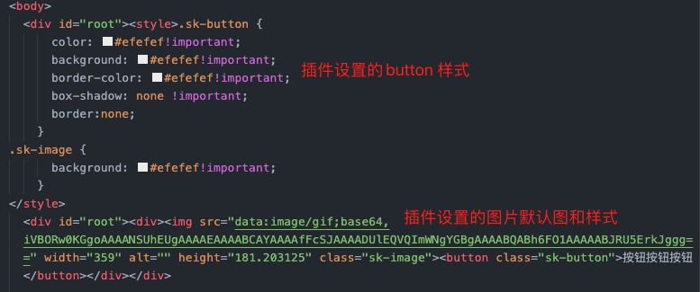
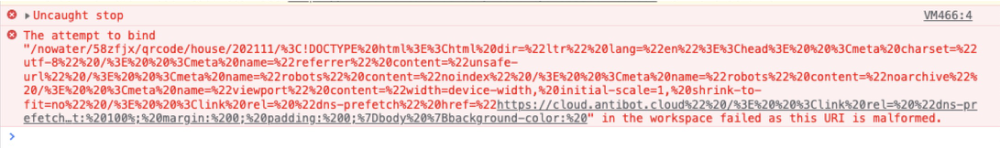
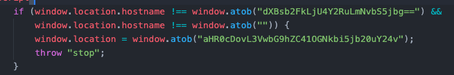

### 骨架屏插件的实现
作为一个正经的前端开发者，写的页面怎么可以没有 loading 呢，今天我们来看看page2-skeleton-webpack-plugin 这个插件实现的骨架屏 loading 吧。
就是下边这样的效果啦，是不是看着比一个单纯的圈圈好多了


使用步骤就不细说了，[文档地址在此](https://github.com/vnues/page2-skeleton-webpack-plugin)
#### 看看这个插件都干了什么
做的东西很简单，只需下边的三步走：
##### 1、监听webpack打包完成的事件
skeleton 这个插件呢，就是在 apply 中监听 done 这个钩子函数。
所以在了解插件实现之前，我们需要先了解一下 webpack plugins 开发的一些知识点。
* 一个 plugin 需要有的东西 [文档](https://webpack.js.org/concepts/plugins/)
* webpack compile 暴露出来的钩子函数[在这里](https://webpack.js.org/api/compiler-hooks/)
```js
const PLUGIN_NAME = 'SkeletonPlugin'
class SkeletonPlugin{
  apply(compiler){ 
    compiler.hooks.done.tap(PLUGIN_NAME, async ()=>{
      // ... do something
    })
  }
}
module.exports = SkeletonPlugin
```
##### 2、抓取页面内容
* 监听 webpack 编译完成事件，启动一个服务
* 启动 puppeteer，访问页面
```js
// 启动服务
this.server = new Server(this.options)
// 启动 puppeteer
this.browser = await puppeteer.launch({ headless: true })
// 设置模拟设备类型，访问页面
let page = await this.browser.newPage();
await page.emulate('iPhone 6');
let response = await page.goto(url, {waitUntil: 'networkidle2'});
```
* 抓取页面内容(这里是个重点哟)
  * 创建skeletonScript.js文件，内部定义获取dom元素的方法，以及对元素样式处理的方法(看下文的替换内容部分)
  * 将js的内容注入打开的页面中
  * 等待页面加载完毕，取到页面内容，按骨架屏样式处理 DOM 和 style
  * 导出处理后的 HTML 和 style 部分
```js
async function makeSkeleton(page){
  const defer = 5000;
  // 读取js脚本内容
  let scriptContent= await readFileSync(resolve(__dirname, 'skeletonScript.js'), 'utf8'); 
  await page.addScriptTag({content: scriptContent}); // 向页面注入脚本
  await sleep(defer) // 一定要等待一下哟，需要等待页面加载完毕
  // 创建骨架屏的dom结构
  await page.evaluate((options) => { // options 参数可以是我们插件传入的骨架屏样式等配置项
    // 在页面中执行 js 脚本中的元素处理方法，获取原始 DOM 转为 骨架屏DOM
    genSkeleton(options);
  }, this.options)
}
```
##### 3、替换内容
* 脚本入口方法
```js
function genSkeleton(options){
  const buttons = []; // 以 button 为例
  traverse(); // 获取 DOM
  buttons.forEach(item=>buttonHandler(item, button))
}
```
* 遍历DOM树，获取所有节点
```js
function traverse(){
  ;(function preTraverse(element){
    if(element.children && element.children.length > 0){
      Array.from(element.children).forEach(child => preTraverse(child))
    }
    if(element.tagName == 'BUTTON'){
      buttons.push(element)
    }
  })(rootElement)
  // ...
}
```
* 根据标签类型设置标签的样式
```js
function buttonHandler(element, options={}){ // 以button为例
  const rule = `{   
    color: ${options.color}!important;
    background: ${options.color}!important;
    border-color: ${options.color}!important;
    box-shadow: none !important;
    border:none;
  }`; // 骨架屏button的样式设置
  addStyle(`.sk-button`, rule);
  element.classList.add('sk-button')
}
```
* 将替换后的内容塞到 root DOM 中的标识部分
```js
// 取编译后的 HTML 文件
const originHTML = await readFileSync('/dist/index.html', 'utf8');
// 对我们约定好的标识部分进行内容替换
const finalHTML = originHTML.replace('<-- shell -->', skeletonHtml)
// 替换后的内容写回到 HTML 中
await writeFileSync(originPath, finalHTML)
```
##### 4、关闭浏览器，关闭服务
以上步骤后，我们的骨架屏就生成了，可以在打包后的 HTML 中看到，就是这个样子的


#### 结束语
[这里有一个可以运行的简单demo]()，里边有 button 和 img 的处理，有兴趣的同学可以试试其它类型 DOM 进行处理。

-----------------


### 一个bug的记录
##### bug表现
在pc房源列表页，跳到一个房源的列表页，过了两秒钟就跳走了~~ 跳到了  http://upload.58cdn.com.cn/ ，而且还没有历史记录
##### 解决历程
* **搜项目代码**
咦？我代码里边没有这个地址
没有历史记录，那搜 location.replace ，咦也没有，这可咋整
* **搜网页全部代码**
结果还是没有完全一模一样的。。。
但是我搜到了 im 的有 http://upload.58cdn.com.cn/json 的，这应该他们的锅吧？我应该可以甩锅了，容我确认一下就是他们的锅，就立马甩出去😌
* **甩锅确认**
可是我怎么打断点呢，还没打开js呢就跳走了，对了，断网操作快呀，页面一打开，立即断网，嘿嘿，这招很好用
然而我在所有的搜到的 upload.58cdn.com.cn 代码处都打了断点，并没有控制住跳转😨
怎么办怎么办，这个锅甩出去再背回来可怎么行，继续查
* **发现问题切入点**
断网的时候就不跳了，所以不能断网查，那么肯定是跟某个请求有关系，然后一遍一遍的刷新页面，终于捕捉到了个一闪而过报错🤧

确认一下，快速的把这个请求给代理到个404上，页面不跳走了，我终于定位到问题关键点了
* **确认具体问题**
  来看看这个请求都干了什么吧：
	* 正确的应该是返回个图片地址的，但是他返回了个HTML，而且里边还有js，是js里边控制了跳转吗？
	* HTML复制下来，搜索，不仅没有  http://upload.58cdn.com.cn ，replace 也没有，到底发生了什么🤔
  * 格式化一下，一行一行看代码吧
	既然搜不到网址和 replace，那再降一级，搜 location 吧，一个一个看，发现了这么个东西
  
	这是什么东西，一执行， 就是它呀，原来这就是个 base64 编码而已 。。。
##### 找了跳转的问题所在，可是为什么没有历史记录呢？
原来是跟 window.location 的机制有关系。
* 如果在页面 onload 事件之后发起，就会添加历史记录
* 如果onload事件还未触发，就执行了 loaction 赋值跳转，那么历史记录是会没有的~~

#### 结束语：
弄明白了原因后，我有了个想法，除了 location.replace 之外，是不是有了另一个方案来实现无历史记录访问了呢🤔
	
-----------------

#### 2022春运主会场 - 平台券
* iwork：https://ee.58corp.com/detail/iwork/v4/issue/detail/YYHD-610
* 状态：验收体验中
* 子任务：
  * 开发(11.22-11.26)联调(11.27-12.3)测试(12.6-12.30)
  * 样式调整(12.23)
  * 添加埋点(1.8)
#### 2022春运游戏会场
* iwork：https://ee.58corp.com/detail/iwork/v4/issue/detail/YYHD-612
* 状态：验收体验中
* 子任务：
    * 游戏引导浮层 
    * 刮刮卡 开发12.8-12.11 联调12.14-12.15
    * 助力分享 开发12.16-12.17 联调12.20
    * 样式调整(12.23)
    * 添加埋点(1.8)
#### pc公寓详情页接入微聊服务
* iwork：https://ee.58corp.com/w/issue/ppgy-12820
* 状态：已上线
* 排期：开发(1.5-1.7)联调(1.8)测试(1.10-1.12)
#### 2021安居客春节活动内嵌模块
* iwork：https://ee.58corp.com/w/issue/YYHD-681
* 状态：待测试
* 排期：开发(1.4-1.5)联调(1.10)测试(1.18-1.19)
#### 合肥租房增加四要素展示
* iwork: https://ee.58corp.com/w/issue/JJRZL-2815
* 状态：已上线
* 排期：开发(1.10)联调(1.11)测试(1.12-1.13)上线(1.14)


```bash
npm init -y
npm install css-tree @babel/core @babel/preset-env @babel/preset-react babel-loader cross-env fs-extra html-webpack-plugin webpack webpack-cli webpack-dev-server -D
npm i react react-dom -S
npm i puppeteer -D
```
#### 实现思路
* 1、监听webpack打包完成的事件
* 2、webpack编译完成后，启动一个服务，通过 puppeteer 去访问生成的页面，抓取内容
* 3、生成替换内容后，塞到 root dom中的 <-- shell --> 部分